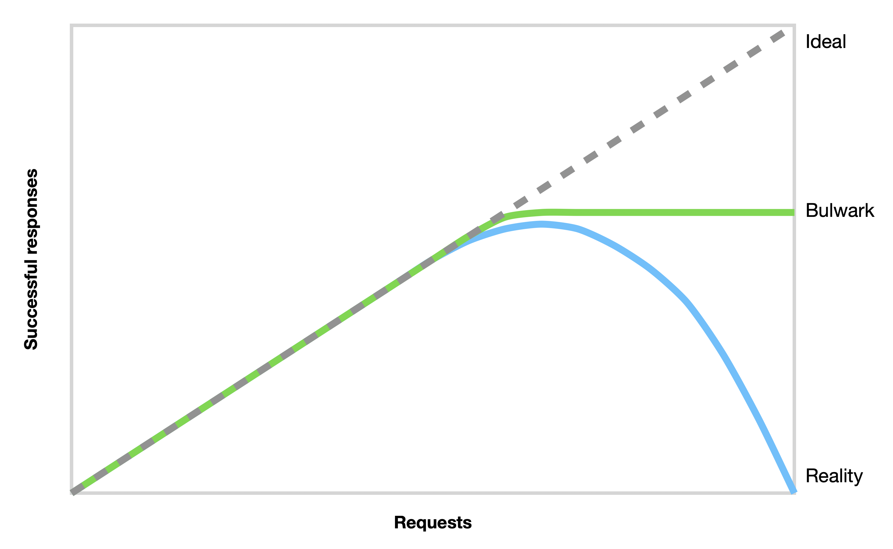

# Bulwark

- [Bulwark](#bulwark)
	- [Quick start](#quick-start)
	- [Error handling](#error-handling)
		- [Situational](#situational)
		- [Global](#global)
		- [`deixis/faults`](#deixisfaults)
	- [Fallback](#fallback)
	- [Priority](#priority)
		- [Standard buckets](#standard-buckets)
		- [Priority via arguments](#priority-via-arguments)
		- [Context-based priority](#context-based-priority)
	- [Configuration](#configuration)
		- [Throttle ratio](#throttle-ratio)
		- [Throttle minimum rate](#throttle-minimum-rate)
		- [Throttle window](#throttle-window)
		- [Accepted errors](#accepted-errors)
	- [Under the hood](#under-the-hood)
	- [Inspirations](#inspirations)
	- [Further reading](#further-reading)



**Bulwark** is a self-tuning adaptive throttle written in Go, designed to enhance the resilience of distributed services.

Distributed services are particularly susceptible to cascading failures when parts of the system become overloaded. Graceful handling of these conditions is critical for maintaining reliability, and Bulwark provides an effective solution. By monitoring recent request outcomes, such as "service unavailable" or "quota exhaustion" errors, Bulwark dynamically adjusts traffic flow. When it detects signs of overload, it self-regulates by limiting the number of requests allowed to proceed. Requests that exceed this limit fail locally and are prevented from being propagated, reducing strain on remote systems.

In normal conditions, when resources meet demand, Bulwark operates passively, allowing all traffic to flow without interference. Unlike traditional throttling mechanisms, Bulwark does not queue requests, ensuring no additional latency is introduced to request handling.

## Quick start

```go
package main

import (
	"context"
	"fmt"

	"github.com/deixis/bulwark"
)

func main() {
	ctx := context.TODO()

	// This creates an adaptive throttle with the default number of priorities
	// available priorities.
	// For example, StandardPriorities creates 4 buckets, which accepts values
	// from 0 to 3. Any value out of bound causes a panic.
	throttle := bulwark.NewAdaptiveThrottle(
		bulwark.StandardPriorities,
		// Other options can be set here (See Configuration section)
	)

	// Any function that needs to be throttled can be wrapped with a throttle.
	// Each function call has a priority level set, which will be used to determine
	// how the throttle should prioritse the call when the system is under load.
	err := throttle.Throttle(ctx, bulwark.Medium, func(ctx context.Context) error {
		// Call external service here...
		var err error
		if err != nil {
			// Wrap error when it should be considered for throttling.
			// By default, errors are ignored unless they are from the `faults` package.
			// See the Error handling section for more info.
			return bulwark.RejectedError(err)
		}

		return nil
	})
	if err != nil {
		if err == bulwark.ClientSideRejectionError {
			// Call dropped
		}

		// Handle error
	}

	// When the throttled function needs to return a value, this function can be used.
	msg, err := bulwark.Throttle(ctx, throttle, bulwark.Medium, func(ctx context.Context) (string, error) {
		// Call external service here...
		var err error
		if err != nil {
			// Wrap error when it should be considered for throttling.
			// By default, errors are ignored unless they are from the `faults` package.
			// See the Error handling section for more info.
			return bulwark.RejectedError(err)
		}

		return "Hello", nil
	})
	if err != nil {
		if err == bulwark.ClientSideRejectionError {
			// Call dropped
		}

		// Handle error
	}
	fmt.Println(msg)
}

```

## Error handling

Load shedding and error handling go hand in hand. It is crucial to correctly identify errors symptomatic of server overload to apply backpressure only when necessary. For example, bad requests, authentication failures, or missing resources are expected errors and generally do not indicate resource constraints.

### Situational

By default, Bulwark ignores standard Go errors. To indicate that an error is due to capacity issues and should trigger backpressure, explicitly wrap it using `bulwark.RejectedError`:

```go
err := throttle.Throttle(ctx, bulwark.Medium, func(ctx context.Context) error {
	return bulwark.RejectedError(errors.New("internal error"))
})
if err != nil {
	// Bulwark unwraps RejectedError to return the original error (internal error)
}
```

> 💡 Wrapping errors with `bulwark.RejectedError` is suitable for initial implementations and simple use cases. However, avoid adding excessive error-handling logic within the throttled function, because it is not easily reusable and can lead to inconsistencies.

### Global

Bulwark provides a global function, `bulwark.IsRejectedError`, to classify errors for throttling. This is especially useful for handling well-known error types across the codebase, reducing logic duplication in throttled functions.

Errors wrapped with `bulwark.RejectedError(err)` are always treated as capacity issues, so you don't need to include them in your `bulwark.IsRejectedError` implementation.

```go
bulwark.IsRejectedError = func(err error) bool {
	// For example, all timeouts could be considered as a capacity problem.
	tempErr, ok := err.(interface {
		Timeout() bool
	})
	if ok && tempErr.Timeout() {
		return true
	}
	// a "Connection Reset by Peer" could also show symptoms of a capacity problem.
	if errors.Is(err, syscall.ECONNRESET) {
		return true
	}
	// Include the default logic
	if bulwark.DefaultRejectedError(err) {
		return true
	}

	return false // Use true or false by default to have a white/black list approach.
}
```

> 💡 This approach works well in codebases with consistent error definitions for capacity-related issues. For instance, an [Echo](https://echo.labstack.com) server might override `bulwark.IsRejectedError` to include `echo.*HTTPError`.

### `deixis/faults`

Bulwark integrates with the [`deixis/faults`](https://github.com/deixis/faults) library through `bulwark.DefaultRejectedError`. This integration provides a structured and consistent way to categorise errors using well-defined primitives, offering significant benefits beyond load shedding.

```go
err := throttle.Throttle(ctx, bulwark.Medium, func(ctx context.Context) error {
	// e.g., HTTP 400 Bad Request
	// A client-side error is not considered a rejection.
	return faults.Bad()

	// e.g., HTTP 403 Forbidden
	// A permission error is not considered a rejection.
	return faults.PermissionDenied()

	// e.g., HTTP 429 Too Many Requests
	// A quota failure is considered a rejection.
	return faults.ResourceExhausted()

	// e.g., HTTP 5XX
	// A server error is transient and could indicate capacity issues.
	// Internal Server Errors are generic; if they occur sporadically,
	// they shouldn't trigger large-scale load shedding.
	return faults.Unavailable(0)

	return nil
})
if err != nil {
	// Handle error
}
```

> 💡 While this approach may require reworking large parts of an existing codebase, it is highly recommended for its long-term benefits.

**Key benefits**

1. **Consistency Across Codebases**: By using a shared vocabulary like `faults.AvailabilityFailure` or `faults.QuotaFailure`, developers can handle errors uniformly across systems and services. Whether errors originate from an HTTP client, a database, or an internal process, their meaning and behaviour remain clear.
2. **Simplified Observability**: Categorised errors improve logging and monitoring. For instance, a bad user request should propably not wake you up at 3 AM, but too many `faults.AvailabilityFailure` maybe should.
3. **Resilient Retry Policies**: Error primitives like `faults.AvailabilityFailure` explicitly define transient issues, enabling robust retry mechanisms across the system. This reduces the risk of retrying non-recoverable errors like bad requests.
4. **Reduced Complexity**: Centralising error definitions eliminates scattered, ad-hoc logic across the codebase. This simplification improves maintainability and reduces the chances of handling errors inconsistently.
5. **Improved Collaboration**: Shared error primitives foster better integration across teams and systems. Services can propagate well-defined errors, avoiding the need for redundant error mapping or ambiguous interpretations.

## Fallback

While dropping calls addresses capacity issues, returning an error may not always be desirable or practical. Bulwark’s fallback function provides an elegant solution by enabling a secondary execution path when a request is dropped. This allows your application to degrade gracefully, providing meaningful responses even under load.

Fallbacks are particularly valuable in scenarios where partial functionality is preferable to failure:

- **Recommendation Systems**: Return a static or default list of products when personalised recommendations cannot be fetched.
- **Authentication Services**: Temporarily fail open to ensure user access during outages, provided security policies permit.

```go
msg, err := bulwark.Throttle(ctx, throttle, bulwark.Medium, func(ctx context.Context) (string, error) {
	// Call external service here...
	return "call", nil
}, func(ctx context.Context, err error, local bool) (string, error) {
	if local {
		// Bulwark rejected the request
	} else {
		// Error returned from the main function
	}

	return "fallback", nil
})
if err != nil {
	// handle the error
}
```

> 💡 The fallback function is invoked when the main function returned an error or was skipped due to throttling.

## Priority

When the system reaches capacity, Bulwark dynamically adjusts the likelihood of processing a request based on its priority. Higher-priority requests are given a better chance of being processed, ensuring they experience a lower error rate during overload conditions. This prioritisation is achieved through a probabilistic model, meaning no additional latency is introduced to request handling.

> 💡 Under normal conditions, the system operates with sufficient spare resources, treating all request priorities equally to ensure fairness.

### Standard buckets

Bulwark provides four standard priority levels, which can be used to classify requests:

```go
// Use High when for requests that are critical to the overall experience.
bulwark.High
// Use Important for requests that are important, but not critical.
bulwark.Important
// Use Mediuam when a higher failure rate would not significantly impact the experience
bulwark.Medium
// Use Low for trivial requests and good for any system that can retry later when the system has spare capacity.
bulwark.Low
```

### Priority via arguments

In cases where priority is known at compile time, you can specify it directly as an argument to Throttle. For example, an API client might assign higher priority to authentication calls compared to non-critical operations like analytics.

```go
priority := bulwark.Medium
msg, err = bulwark.Throttle(ctx, throttle, priority, func(ctx context.Context) (string, error) {
	// Call external service here...
	return "World", nil
})
if err != nil {
	// handle the error
}
```

### Context-based priority

For scenarios where priority cannot be determined at compile time or within a single function’s scope, Bulwark allows you to attach priority to the `context.Context`. This approach enables dynamic priority assignment based on the broader context of a request.

```go
ctx = bulwark.WithPriority(ctx, bulwark.Medium)
```

When a priority is set in the `context.Context`, it overrides the default priority passed as an argument to Throttle, enabling finer-grained control over request handling.

```go
ctx = bulwark.WithPriority(ctx, bulwark.High)
bulwark.Throttle(ctx, throttle, bulwark.Medium, func(ctx context.Context) (string, error) {
	// This call will use `bulwark.High` as the priority level
	return "World", nil
})
```

## Configuration

### Throttle ratio

The throttle ratio (a.k.a `k`) is a variable which determines the number of requests accepted based on the observed limit.

For example, when `k=2` the throttle **will allow twice as many requests to actually reach the backend as it believes will succeed.** Reducing the modifier to `k=1.1` means 110% of the observed limit will be allowed to reach the backend.

Higher values of `k` mean that the throttle will react more slowly when a backend becomes unhealthy, but react more quickly when it becomes healthy again, and will allow more load to an unhealthy backend. `k=2` is usually a good place to start, but backends that serve "cheap" requests (e.g. in-memory caches) may need a lower value.

> We generally prefer the 2x multiplier. By allowing more requests to reach the backend than are expected to actually be allowed, we waste more resources at the backend, but we also speed up the propagation of state from the backend to the clients. [Google SRE book]

```go
throttle := bulwark.NewAdaptiveThrottle(
	bulwark.StandardPriorities,
	bulwark.WithAdaptivethrottleatio(1.1),
)
```

### Throttle minimum rate

Configure the minimum number of requests per second that the adaptive throttle will allow (approximately) to reach the backend, **even if all requests are failing**. Sending a small number of requests to the backend is critical to continuously evaluate its health and tune the throttle.

```go
throttle := bulwark.NewAdaptiveThrottle(
	bulwark.StandardPriorities,
	bulwark.WithAdaptiveThrottleMinimumRate(0.5),
)
```

### Throttle window

Set the time window over which the throttle remembers requests for use in figuring out the success rate.

A larger window will make the throttle react more slowly to changes in the backend's health, but will also make it more resilient to short-term fluctuations in the backend's health. But a larger window will also increase the amount of memory used by the throttle.

By default, it uses a window of `1 * time.Minute`

```go
throttle := bulwark.NewAdaptiveThrottle(
	bulwark.StandardPriorities,
	bulwark.WithAdaptiveThrottleWindow(5 * time.Minute),
)
```

### Accepted errors

Set the function that determines whether an error should be considered for the throttling. When the call to `fn` returns true, the error is NOT counted towards the throttling.

```go
isAcceptedErrors := func(err error) bool {
	return errors.Is(err, context.Canceled) // || other conditions
}
throttle := bulwark.NewAdaptiveThrottle(
	bulwark.StandardPriorities,
	bulwark.WithAcceptedErrors(isAcceptedErrors),
)
```

> Errors unrelated to resource constraints or a service's inability to handle traffic should be allowed. For instance, errors caused by invalid user requests or authentication failures should be accepted.

## Under the hood

Bulwark determines the probability of a request succeeding based on observed successes and failures. The calculation is performed using the following formula:

```go
rejectionProbability := max(0, (requests - K * accepts) / (requests + 1))
```

Under normal conditions, the number of `requests` equals the number of `accepts`. However, as the backend begins to reject traffic, the number of `accepts` becomes smaller than the number of `requests`. Clients are permitted to continue sending `requests` to the backend until the `requests` count reaches `K` times the number of `accepts`. At this threshold, Bulwark begins to self-regulate and new `requests` are rejected.

As Bulwark starts rejecting `requests`, `requests` will continue to exceed `accepts`. Although locally rejected requests do not reach the backend, this behaviour is intentional and serves to prevent system overload. As the rate of `requests` attempted by the application grows relative to the backend's acceptance rate, Bulwark increases the probability of rejecting new `requests` to manage the imbalance and maintain stability.

## Inspirations

Most reliability libraries in Go either lack robust support for `context` propagation and cancellation and very few provide support for Quality of Service (QoS) prioritisation when services are under heavy load.

This gap inspired me to create this library. I started by building upon the `AdaptiveThrottle` implementation from `bradenaw/backpressure`, which provided the foundational concepts I needed. A big thank you to Braden Walker for his excellent work!

The design of this library is also shaped by my experiences managing failures in distributed systems and insights drawn from the remarkable work done at Netflix and Google.

## Further reading

1. [Handling Overload - Google](https://sre.google/sre-book/handling-overload/)
2. [Performance Under Load - Netflix](https://netflixtechblog.medium.com/performance-under-load-3e6fa9a60581)